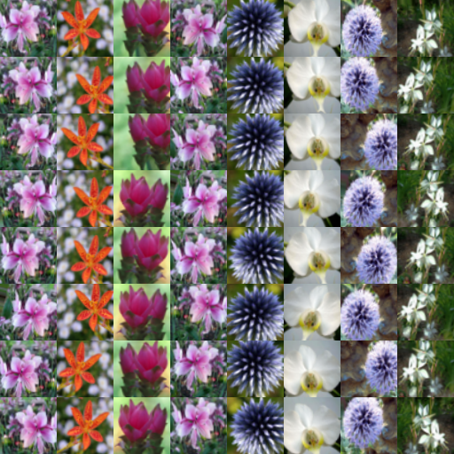
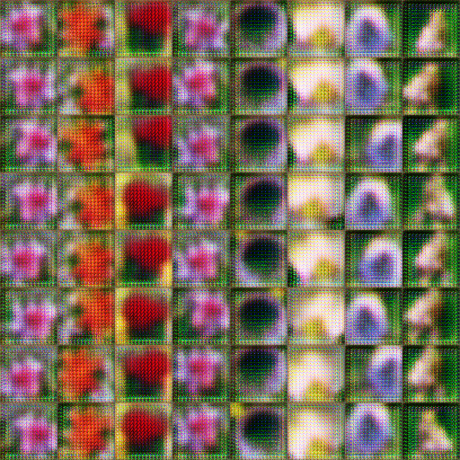
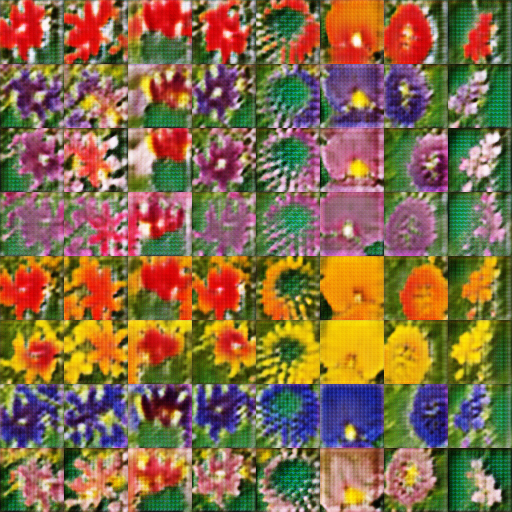
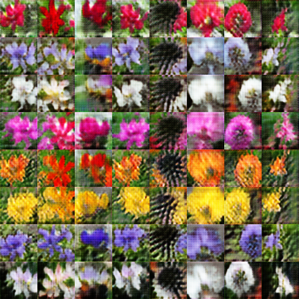
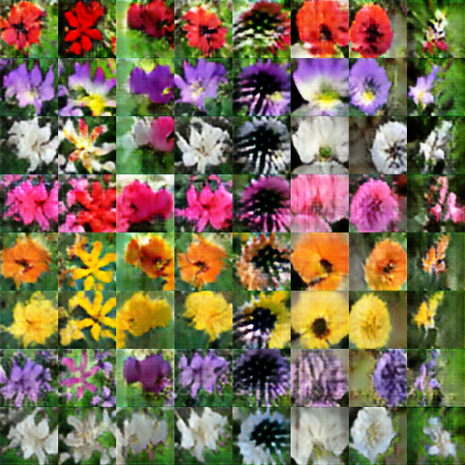

# 对图像进行语义性篡改的实现
## 网络细节

除了文本编码过程中未采用stackgan中的condition augmention，其他结构均采用了论文中的设计。训练过程中数据集采用的Oxford102。

## 原图

## 预处理后

the flower shown has yellow anther red pistil and bright red petals.

this flower has petals that are yellow, white and purple and has dark lines

the petals on this flower are white with a yellow center

this flower has a lot of small round pink petals.

this flower is orange in color, and has petals that are ruffled and rounded.

the flower has yellow petals and the center of it is brown.

this flower has petals that are blue and white.
                      
these white flowers have petals that start off white in color and end in a white towards the tips.

## 300次epcho后的结果

## epcho 0 

## epcho 50

## epoche 100

## epoche 150

## epoche 200

## epoche 250

