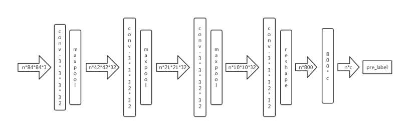
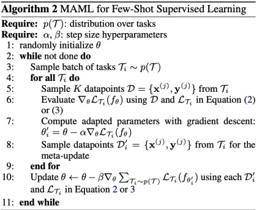

# 模型无关元学习--在小样本学习上的应用

## 元学习

在解释元学习之前，我先向大家简单的介绍一下传统的深度学习是怎么训练一个模型的

传统的深度学习是一种data hungry的技术，需要大量的的标注样本喂给我们搭建好的模型去训练,然后得到我们想要的可以用来预测的数学模型。

通常来讲我们所理解的AI，有一个关键的特征，这个特征就是多面性，它应该是可以完成多种不同任务的。

但是目前的AI系统只擅长掌握单项技能，比如能够区分猫和狗的模型无法区分狮子和老鼠。
你必须给模型喂入狮子和老鼠的图片，让模型从头开始训练。

如果想获得一个拥有多个技能的AI系统，是不是每个技能都要从头开始训练呢？

当然现在的AI系统可以通过大量时间和经验从头学习一项复杂的技能，然而独立地训练每一个新任务是需要消耗大量的时间和资源，代价是巨大的。

如果我们想使智能体掌握多种技能，适应多种环境的话，则不应该在每一个环境中从头开始训练每一项技能，我们需要智能体能够通过对以往经验的再利用来学习如何学习多项新任务，就想我们人类一样。这种学习如何学习的方法，就是元学习，这是一条通往可持续学习多项新任务的多面智能体的必经之路。

下面我就举一些例子来帮助大家更好的理解元学习。

我们在教小朋友读英语的时候，可以直接让他们模仿apple、banana的发音。但是他们很快又会遇到新的单词，例如strawberry，这时小朋友就需要重新听你的发音，才能正确地读出这个新单词。

我们换一种方式，这一次我们不教每个单词的发音，而是教音标的发音。当小朋友再次遇见新单词的时候，他们只要根据音标，就可以正确地读出这个单词。

这个学习音标的过程，就是一个元学习的过程。

正如meta learning 元学习的另一个名称，learning to learn 学会学习，元学习，是要学会如何学习，也就是利用以往的知识经验来指导新任务的学习，它应该具有学会学习的能力。

我前面介绍的传统的深度学习模型，它的目的是训练一个用于预测的数学模型，而元学习和传统的深度学习不一样，元学习面向的不是学习的结果，而是学习的过程。它学习的结果不是一个直接用于预测的数学模型，而是得到一个元学习器，然后用这个元学习器训练 更快更好地学习一个数学模型。

首先我解释一下 model-agnostic 模型无关

这一块我们搭建好的模型理论上只要是采用梯度下降算法的模型都可以兼容这种元学习方法，你可以替换成任何一种采用随机梯度下降算法的模型。所以这个元学习方法可以应用于多种任务上，包括分类，回归，甚至是强化学习。所以它可以是model-agnostic

然后解释下是fast adaption

模型无关元学习与其说是一个深度学习模型，倒不如说是一个框架，它提供一个meta-learner 用于训练 base-learner。这里的meta-learner 就是这个元学习器，它是maml的精髓所在，用于learning to learn。
而base-learner则是在目标数据集上被训练，并实际用于预测任务的真正的数学模型。
而训练base-learner的过程就是一个fast adaption的过程，这个训练过程类似于fine-tune。

好，讲完元学习，下面我们总结一下模型无关元学习

- 目标：
  - 从多个不同的学习任务中，学习到一个模型，这个模型能够快速学习如何解决一个只含有少量训练样本的新任务。
- 核心思想：
  - 寻找一个模型的初始值，使得该模型能在新任务的少量训练数据上进行快速学习，获得一个较好的效果。

它的核心思想里也体现了fask adaption的特点

刚才有提到了少量训练样本，这里正好引出小样本学习，下面我将向大家介绍一下小样本学习。

## 小样本学习

我们都知道，现在的绝大多数的深度学习方法都是数据驱动的，也就是说需要大量的标注样本训练，模型才能发挥作用，但是在现实世界中，有很多问题是没有这么多的标注数据的，并且获取标注数据的成本也非常大， 例如在医疗领域、安全领域等。而我们人类，是非常擅长通过极少量的样本识别一个新物体的，比如说小孩子只需要书中的一些图片就可以认识什么是斑马，什么是犀牛。通过人类快速学习能力的启发，我们希望机器学习模型在学习一定类别的大量数据后，对于新的类别，只需要少量的样本就能快速学习，这就是小样本学习要解决的问题

以cifar-10图像分类为例，传统的方法是基于左边这些训练集，获得模型，然后对右边测试集进行自动标注。而小样本问题如右边这张图所示，我们大量拥有的是上方这五类数据，而新问题也就是下方这五类只有很少的标注数据。

当标注数据量比较少时，怎么学习出好的特征？我们需要做的是泛化这些罕见的类别，而不需要进行额外的训练，训练会因为数据少，代价高，周期长而无法获得收益。

近几年已经出现好几种方法来解决小样本问题，后面我将着重介绍一下今天的主角 model-agnostic meta-learning, 在小样本学习上的应用。

在此之前，我还得向大家介绍几个概念，

### N-way K-shot

N-way K-shot 是 小样本学习 中常见的实验设置

- N-way 指随机抽取训练数据集中 N 个类别
- K-shot 指每个类别用于训练的标记样本数量

这个实验设置的目标就是要求模型从 N*K 个数据中学会如何区分这 N 个类别，最终的模型是多少个类的分类器，就取决于这个N的取值。

### Task

T <support set , qurey set>
- NK shot for support set --> train set
- NK' shot for qurey set --> test set

如果说传统深度学习方法训练的每一个sample是一张张的图片，那么元学习方法训练模型的每一个sample则是 一个 task。

一个task 由两部分组成，support set  ，  qurey set，根据上一张ppt介绍的N-way K shot，这里的support set 就是从数据集里随机抽取N个类的数据，再从每个类里抽取K个样本，总共就是NK个样本，qurey set 就是从前面随机抽取的N个类中，再随机抽取K' 个样本，组成NK'个样本作为qurey set。

这里的support set 可以看作是训练集，qurey set 则是测试集

举一个实际的例子帮助大家理解：

我们假设这样一个场景：我们需要利用MAML训练的元学习器去训练一个数学模型M,目的是对未知标签的图片做分类，类别包括p1～p5  每个类20个样本

现在我们先要用训练数据，C1～C10 10个类的数据训练元学习器M_meta ， C1～C10 每个类30个样本，

实验设置为5-way 5-shot

首先我们要从C数据中 随机抽取5个类，每个类随机抽取20个样本，其中5个样本作为support set，其他15个样本作为qurey set 。再把 support set 和 qurey set 组合起来 构成一个 task。这个task 就相当于普通深度学习模型训练过程中的一条训练数据。

类似于普通深度学习模型训练过程，一个样本数据肯定是不够的，我们提高多任务泛化能力，就必须有多个task数据。所以这里需要反复在训练数据分布中抽取若干个这样的task。

数据准备好了，接下来就是训练过程了，这个是实验的网络结构图，实验中采用的是一个简单的4层卷积网络作为前向传播网络结构

以softmax作为最后的激活函数，用交叉熵来定义损失函数，和常见的深度学习模型一样，反向传播也是采用的随机梯度下降算法

## meta-learner 训练过程

然后我要重点说明一下，这其中和普通的深度学习方法不同的地方，

首先是训练数据的不同，普通的深度学习方法是基于图片数据来训练的，而元学习是基于task的，虽然从底层来讲也是基于图片的，但是基于task的这个策略也确实带来了一些不同之处

我们首先来分析一下task的构成，一个task 由support set 和 qurey set 两部分组成，那么模型是怎么训练一个task的呢？

和绝大多数模型一样，我们先要初始化参数theta，tensorflow 开启一个训练会话的时候经常干的第一步，tf.global_variables_initialzation()

首先是suppot set  每一个task 的 support set 有NK个样本，把这个NK个样本扔进前面说的那个卷积网络里，前向传播计算loss，反向传播更新参数，得到一个期望参数theta'，这一步的更新并没有替换掉原来初始化的参数，可以这么理解，这里只是复制了一份原来初始化的参数theta，对这个复制的模型参数副本进行更新。然后把这个更新的参数theta' 传给 qurey set ，qurey set 的数据集在这个参数的基础上再训练，类似于普通的深度学习，元学习中训练数据也会组成batch，这里我们以3个task作为一个batch。

然后根据上面所说的，一个batch里面的每一个task的support set 都会复制一个theta副本，经过训练后各自得到一个新的参数，然后每一个task的qurey set 在它们这个task 的support set 上更新的参数的基础上再做一次训练，最后计算一个batch上qurey set上的loss总和 对其进行反向传播随机梯度下降，用这个求得的参数更新元模型的theta参数。

如右下角这张参数示意图所示，每一个task的support set 都会获得一个梯度更新的方向，但最终下降的方向由update theta决定。

## 算法流程

这个是算法的伪代码，整个流程我刚才已经简单的介绍了一下了

我们着重看下两次梯度更新的地方，它们分别用到了不同的学习率，alpha 和 beta ， 这两个符号代表的是不同的学习率，这里的学习率，用在support set上的学习率alpha 比 用在qurey set上的学习率beta要大

为什么要这么设置呢？因为在优化探测task最优参数的位置，我们必须使用稍微大点的学习率，才能达到一步到位的效果，而在优化模型真正的参数时学习率应该是很小的，因为模型需要在参数空间中经过漫长的迭代，慢慢找到最合适的位置。

就想前面说的MAML的核心思想是寻找一个模型的初始值，使得该模型能在新任务的少量训练数据上进行快速学习，获得一个较好的效果。
它面向的不是学习的结果，而是一个学习的过程，是为了获得更好的泛化能力，学习如何更快更好地学习一个数学模型。

以上，我们的元学习器就训练好了，现在我们要在新任务上训练获得最终的数学模型。

## base-learner

这个过程和训练元学习器的过程大致是相同的的，不同的地方主要有：

- 训练最终数学模型不再需要初始化参数，而是直接利用训练好的元学习器的参数，

- 训练最终模型只需要抽取一个task进行学习，自然也就不用形成batch了，训练过程就是用这个task的support set 训练模型，然后利用qurey set 来测试模型。但是在实际的实验中，我们会随机抽取若干个task，分别微调模型，然后对最后的结果取平均值，从而避免极端情况。

- 最为重要的不同的一点，训练最终模型时 ，qurey  set 直接是用来测试模型了，没有进行第二次训练，也就没有第二次梯度更新，而是直接利用support set 梯度计算的结果来更新参数。

## 实验结果

算法介绍完了，接下来就是实验部分了。

论文作者在两个数据集上测试了这个算法的可行性，一个是Omniglot，这个数据集类似于mnist数字手写体，是一种包含1623种不同手写字母的数据集，另一个就是miniImagenet，这个数据集包含100个类，每个类600张图。

作者的实验设置如图所示

- omniglot数据集上设置了5way 1shot 和 5way 5shot， 20way 1shot 和 20way 5shot

- miniimagenet上设置了 5way 1shot 和5way 5shot

作者将论文方法的测试结果与其他方法进行了对比，效果都较好于其他方法。

## 参考资料

- https://www.zhihu.com/question/266497742
- https://zhuanlan.zhihu.com/p/57864886
- https://zhuanlan.zhihu.com/p/40417018
- https://www.jiqizhixin.com/articles/2017-07-20-4
- 机器之心：小样本学习综述
- MAML论文：Model-Agnostic Meta-Learning for Fast Adaptation of Deep Networks
- MAML Tensorflow实现：github:cbfinn/maml
